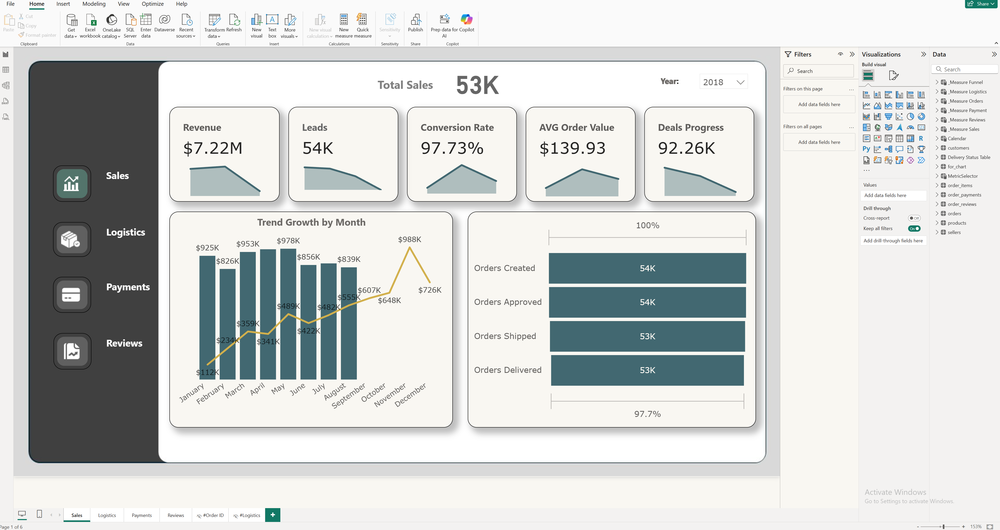
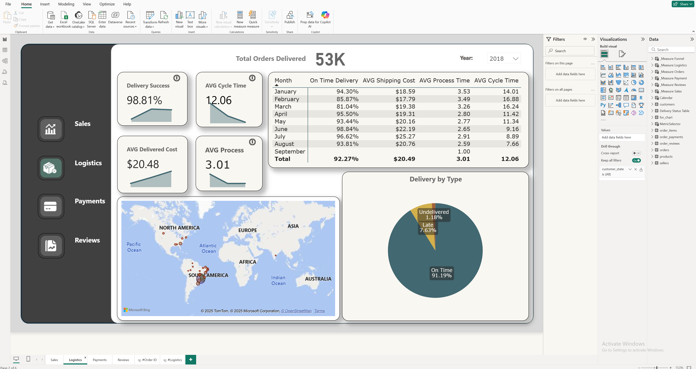
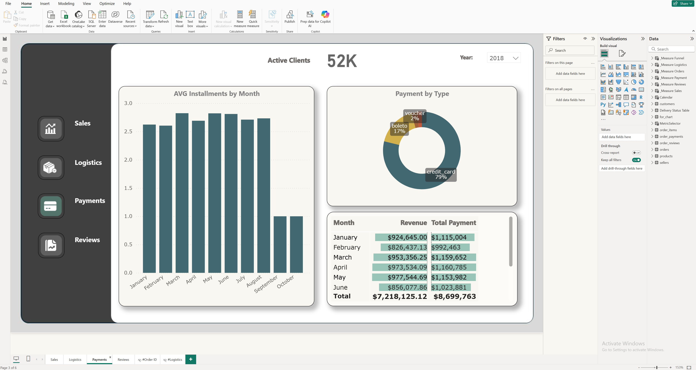
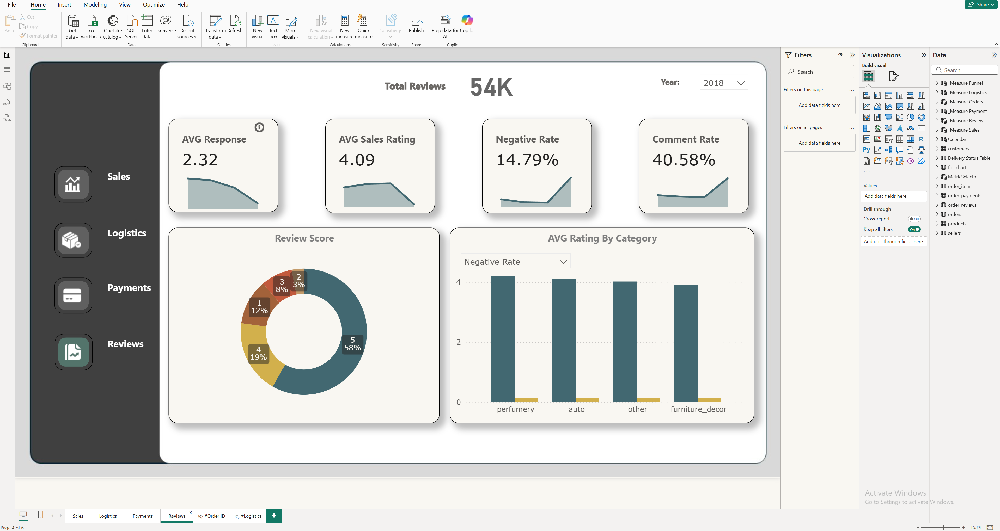

# 📊 Power BI Dashboards Collection

## Overview
A collection of interactive Power BI dashboards for sales, financial flow and profitability analysis.  
Each dashboard applies **DAX**, **Power Query**, and **SQL** to deliver actionable business insights.

---

## Dashboards

### 1. Retail Sales Dashboard
Comprehensive retail sales overview by region, product category and manager.  
**KPIs:** Revenue, Profit, Margin %, Avg Order Value.

### 2. Financial Flows Dashboard
Visualization of company cash inflows/outflows, net income and expense categories.  
**KPIs:** Net Income, Expense Ratio, Cost Structure.

### 3. Profit & Sales Dashboard
Combined analysis of profit and sales performance over time and across channels.  
**KPIs:** Profit Margin, Volume, Channel Mix.

### 4. Sales Dashboard
Dynamic comparison of sales by product, region and time.  
**Filters:** Year, Category, Country, Manager.

---

## Tools & Technologies
- Power BI Desktop  
- DAX  
- Power Query  
- SQL Server / Excel  

---

## Files
| File | Description |
|------|--------------|
| PowerBI_Retail_Sales_Dashboard.pbix | Retail Sales Analysis |
| PowerBI_Financial_Flows_Dashboard.pbix | Financial Flows |
| PowerBI_Prof&Sal_Dashboard.pbix | Profit & Sales |
| PowerBI_Sales_Dashboard.pbix | Sales Overview |

---

## Downloads (.pbix on Google Drive)
- Retail Sales — [link](https://drive.google.com/file/d/124IlSCvUCjRDFMreh19eW1i8uzk1tIJv/view?usp=sharing)  
- Financial Flows — [link](https://drive.google.com/file/d/1iEFnjFhfuuXVm7BvVVXxd6ROPT7umv2i/view?usp=sharing)  
- Profit & Sales — [link](https://drive.google.com/file/d/1HI1gqeINTrXKlinHYx_0-XOeg9REmdUf/view?usp=sharing)  
- Sales Dashboard — [link](https://drive.google.com/file/d/107RXn1DGgeBotGxqbzRIneSidsHNuH01/view?usp=sharing)

> Set sharing: **Anyone with the link – Viewer**.

---

## Screenshots
> A few highlights (more in `/screenshots`).

---

## License
MIT License © 2025 **Denys Mierkulov**

