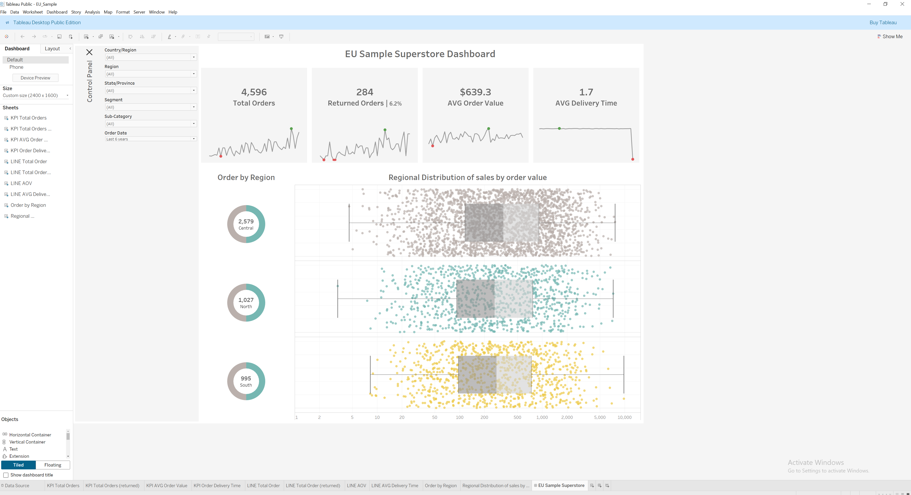
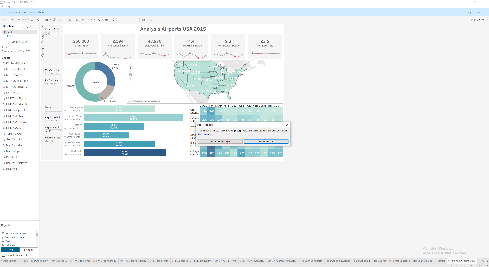
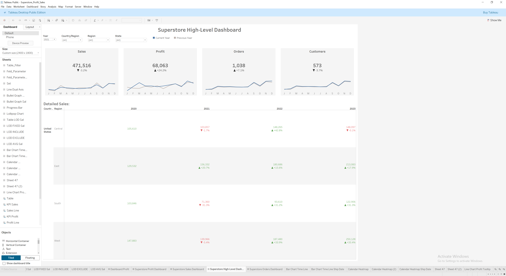
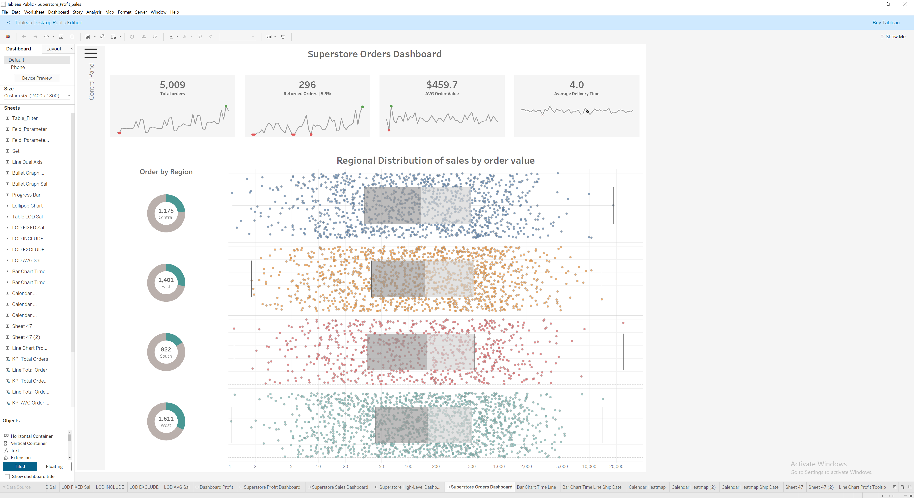
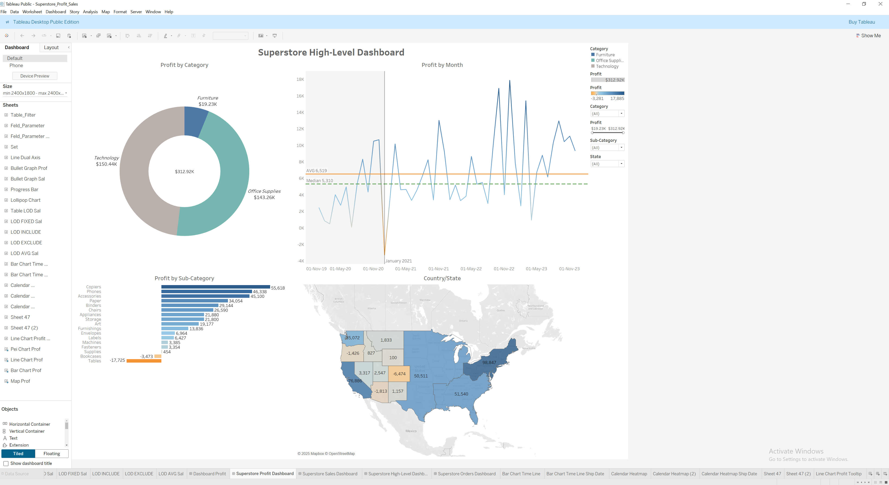
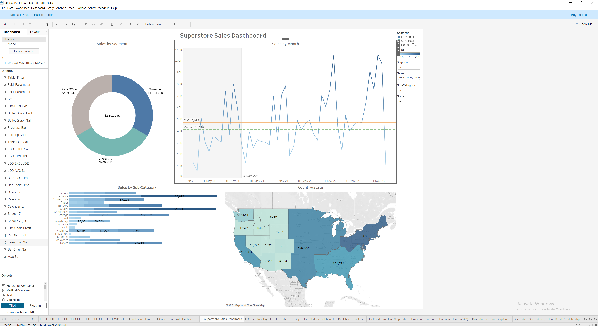

# 📈 Tableau Dashboards Collection

## Overview
A set of Tableau dashboards built for sales, CRM and aviation analytics.  
Each workbook includes interactive filters, KPI indicators and executive-level visualizations.

---

## Dashboards

| File | Description | KPIs |
|------|--------------|------|
| Tableau_AIR_USA_2015.twbx | US flights and delay analytics | Delay %, Flight Volume |
| Tableau_CRM_Overview.twbx | CRM lead and sales funnel overview | CPA, Conversion Rate |
| Tableau_EU_Sample.twbx | European sales demo dashboard | Revenue, Margin |
| Tableau_Superstore_CRM.twbx | Extended Superstore with CRM metrics | Profit, Orders, Discounts |

---

## Tools
- Tableau Desktop 2023+  
- Tableau Prep Builder  
- Excel / CSV / SQL sources  

---

## Downloads (.twbx on Google Drive)
- AIR USA 2015 — [link](https://drive.google.com/file/d/1toW7PbzZVKCvrOBas08M8p07u9dR6K_Z/view?usp=sharing)  
- CRM Overview — [link](https://drive.google.com/file/d/1e9hMuZ8o-p5eowvcc4cGhZrdQVE5KQ2A/view?usp=sharing)  
- EU Sample — [link](https://drive.google.com/file/d/1NgJNbISwOfe4ZyQxyIhbxvhA3GweQr1R/view?usp=sharing)  
- Superstore CRM — [link](https://drive.google.com/file/d/1LCgp5PILjdOPgPdyC1Y8q6x3LoHU_AV3/view?usp=sharing)

> Set sharing: **Anyone with the link – Viewer**.

---

## Screenshots

---

## License
MIT License © 2025 **Denys Mierkulov**
